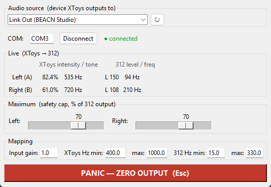

# XToys → MK-312BT Bridge

Lets **[XToys](https://xtoys.app)** control an **MK-312BT** e-stim box (an ET-312B
clone) over its USB **Link** cable. Anything that drives XToys's *Audio E-Stim*
block — you, a remote partner, a script, a tease, video/audio sync — flows
straight through to the box.

It works by **listening to the audio** XToys produces and turning it into serial
commands for the box. No audio is ever fed into the box itself; it's pure Link
control, the same as the standalone MK-312BT Control app.

> **🆕 There's a newer app: [312 Studio](https://github.com/estimtime1/312-studio).**
> It combines this bridge (as its **External** mode) and the standalone
> [MK-312BT Control](https://github.com/estimtime1/mk312bt-control) app (as its
> **Local** mode) into one program with a mode switch and a modern UI. It also adds
> an adjustable **Smoothing** control so XToys power increases ramp up instead of
> jumping. This bridge still works and is kept here, but new users should start
> with 312 Studio.



```
XToys (in your browser)
   │  plays stereo audio  (loudness = intensity, tone pitch = frequency)
   ▼
A virtual audio output  ──►  this Bridge  ──(USB Link / COM port)──►  MK-312BT
                              • measures Left/Right loudness → power
                              • measures Left/Right tone     → frequency
```

---

## ⚠️ Safety — please read first

E-stim carries real risks, and with XToys **other people or scripts can change
your intensity**. Improper use can cause injury.

- **Never route current across your chest or through your heart.** Keep both
  electrodes of a channel **below the waist**.
- **Do not use** with a **heart condition, pacemaker/implant, epilepsy**, or if
  **pregnant**.
- **Set the Bridge's Maximum limits** (per channel) before you start. This is a
  hard cap the Bridge enforces on the box **regardless of what XToys sends** — so
  a script or a remote partner can't exceed your limit. (Also set XToys's own
  maximum.)
- **Start low**, and keep **Esc** (panic) within reach.
- **Stop immediately** if you feel dizzy, faint, or unwell.

Provided as-is, no warranty. **Use at your own risk.**

---

## Contents

- [What you need](#what-you-need)
- [How the pieces fit together](#how-the-pieces-fit-together)
- [Setup](#setup)
  - [1. Get the app](#1-get-the-app)
  - [2. Set the cable's latency timer](#2-set-the-cables-latency-timer)
  - [3. Set up audio routing](#3-set-up-audio-routing)
  - [4. Point XToys at that audio device](#4-point-xtoys-at-that-audio-device)
- [Running it](#running-it)
- [Calibrating](#calibrating)
- [How frequency is mapped](#how-frequency-is-mapped)
- [Troubleshooting](#troubleshooting)
- [For developers](#for-developers)

---

## What you need

**Hardware**
- An **MK-312BT** (or ET-312 / ET-312B) box and its **USB → Link cable**.

**Software**
- **The ready-to-run app:** `XToys-Bridge.exe`, **or** from source: Python 3.10+
  and `pip install pyserial soundcard numpy keyboard`.
- **XToys** open in a browser, with an **Audio E-Stim** block added.
- A way to route XToys's audio to the Bridge (see
  [audio routing](#3-set-up-audio-routing)).

Windows 10 or 11 (64-bit). *(Windows only — it relies on Windows audio capture.)*

---

## How the pieces fit together

XToys's *Audio E-Stim* block doesn't send data — it **plays stereo audio** out an
audio device of your choosing. For each channel, the **loudness is the intensity**
and the **pitch of the tone is the frequency**. The Bridge captures that audio,
measures those two things per channel, and sends matching **power** and
**frequency** to the box over the Link cable.

Because the audio never has to physically reach the box, you route it to a
"virtual" audio device that only the Bridge listens to.

---

## Setup

### 1. Get the app

- **Easiest:** download `XToys-Bridge.exe` and run it. First launch may take a few
  seconds; if SmartScreen warns, click **More info → Run anyway** (unsigned app).
- **From source:** `pip install pyserial soundcard numpy keyboard`, then
  `python xtoys_bridge.py`.

### 2. Set the cable's latency timer

Same one-time tweak as the main app, for low lag: **Device Manager → Ports
(COM & LPT) → USB Serial Port (COMx) → Properties → Port Settings → Advanced →
Latency Timer → change 16 to 1 → OK.**

### 3. Set up audio routing

XToys needs to play its audio to a device that (a) the Bridge can capture and
(b) ideally isn't your speakers (so you don't also hear it, and so other sounds
don't leak in). You have two options:

- **A virtual audio device (recommended).** If you already have virtual outputs
  (e.g. a BEACN, VoiceMeeter, or **[VB-CABLE](https://vb-audio.com/Cable/)** —
  VB-CABLE is free), use one of those as a dedicated pipe: XToys plays into it, the
  Bridge captures it, nothing else touches it.
- **A real output.** You *can* just capture your speakers/headphones output, but
  then the Bridge also picks up every other sound on the PC — not recommended.

Install VB-CABLE if you don't already have a spare virtual output.

### 4. Point XToys at that audio device

In XToys, open the **Audio E-Stim** block's config and set **Output Device** to
the virtual device you chose in step 3. (Set XToys's **Left/Right Maximum** here
too, as a first safety layer.)

---

## Running it

1. Turn the box **on**.
2. Start the Bridge.
3. **Audio source** → pick the **same** device XToys is playing into (click **↻**
   to refresh the list if needed).
4. **COM** → your box's port (default `COM3`) → **Connect**. The status dot turns
   green.
5. Set the **Maximum** sliders (Left/Right) — your hard safety caps.
6. Drive the block from XToys. The **Live** panel shows, per channel, the XToys
   intensity % and tone Hz coming in, and the level/frequency going out to the box.

**Esc** or the **PANIC** button zeroes the box instantly at any time.

---

## Calibrating

Two things you'll usually tune once, in the **Mapping** row:

- **Input gain** — makes the loudness read correctly as intensity. In XToys, run
  intensity to **100%**, then adjust **Input gain** until the Bridge's Left/Right
  read about **100%**. (This compensates for your system/app volume.)
- **Frequency range** — see below.

---

## How frequency is mapped

XToys's frequency is an **audio tone** (its range is typically 400–1000 Hz, up to
400–5000 Hz). The MK-312's frequency is a **pulse rate** (~13–330 Hz). These are
different things, so the Bridge maps them **proportionally**:

- **XToys Hz min / max** — set these to match the frequency range configured in
  your XToys block (default **400–1000**).
- **312 Hz min / max** — the pulse-rate range you want that to map onto (default
  **15–330**). A higher XToys tone → a higher 312 pulse rate.

**Tip:** the 312's frequency is coarse at the fast end, so it feels smoother if you
set **312 Hz max** lower, e.g. **15–180**, so XToys's sweep spreads over pulse
rates that actually change.

---

## Troubleshooting

- **Live intensity stays 0 while XToys is clearly playing** — the **Audio source**
  device doesn't match XToys's **Output Device**, or XToys's volume is very low.
  Pick the same device; check XToys is actually outputting.
- **Intensity maxes out too early / too late** — adjust **Input gain** (calibrate
  at XToys 100%).
- **"312 connect failed / No sync"** — box off, wrong COM port, or the box is
  locked from a previous session — power-cycle the box and reconnect.
- **Feels laggy** — do the latency-timer tweak (setup step 2).
- **Frequency barely changes** — narrow the **312 Hz** range (e.g. 15–180) so the
  mapping lands on register values that actually differ.
- **It also reacts to other PC sounds** — you're capturing a real output; route
  XToys into a dedicated virtual device instead.

---

## For developers

Run from source with `python xtoys_bridge.py`. Files:

- `xtoys_bridge.py` — the app: a background **Analyzer** thread (WASAPI loopback
  capture → per-channel RMS for intensity, FFT peak for tone frequency) feeding an
  output engine that drives the box with smoothed level writes + throttled,
  pinned frequency.
- `mk312.py` — the MK-312BT / ET-312B serial driver (shared with the standalone
  MK-312BT Control app).

**Latency:** the audio window (~10 ms) plus buffering (~10 ms) is the only
inherent delay (~20 ms), then ~4 ms of serial. Intensity is smoothed (a short EMA)
so a steady input holds a steady level; frequency writes are throttled because
each one is several serial writes and the box's frequency is coarse anyway.
